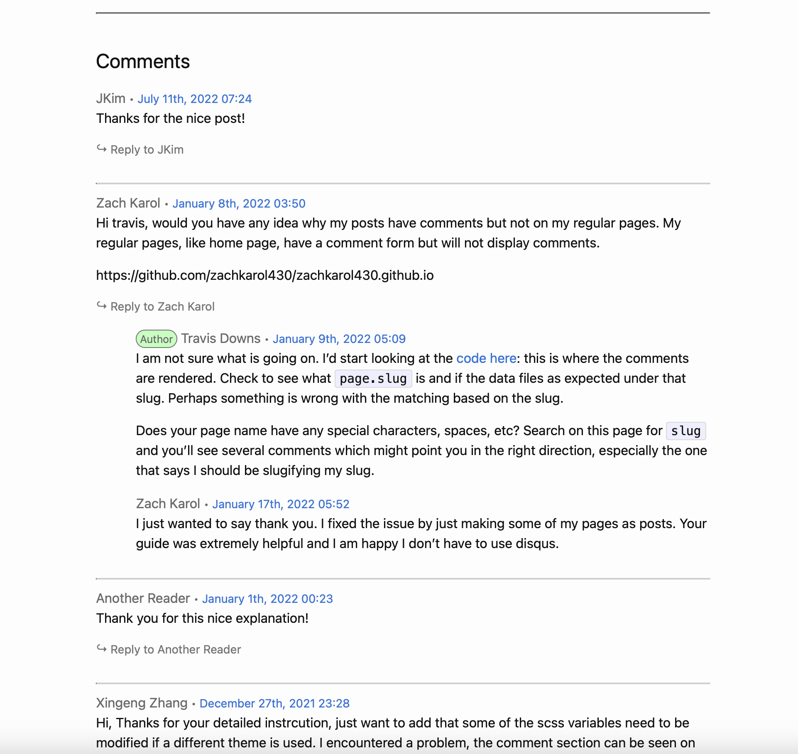

HALF MOON

Keep your feet together, Toes and heels touching.  
Arms over the head sideways.  
Palms together, interlace your fingers.  
Release the index fingers, get a nice tight grip.  
Reach up to the ceiling. Go right and left several times.  
Squeeze your hands together and straighten your elbows.  
Reach up to the ceiling, bend right.  
Reach up to the ceiling, bend left.  
Continuously squeeze your hands together,  
straighten your elbows and stretch up.  
Pause in the middle.  
<b>*</b>Press your palms together. No gap between the palms.  
Elbows locked, arms always touching with the ears.  
Pull your abdomen in.  
Contract your buttocks.  
Contract your legs.  
Body weight in the heels.  
Arms and head back. Chin up.  
Concentrate one point in the mirror.  
Inhale breathing, full lungs.  
Stretch up out of the waist. Touch the ceiling.  
Absolutely straight line, bend your body to the right with straight arms and straight legs.  
Push your hips to the left side.  
Create a stretch on the left side of the body.  
Push the hips, reach your arms,  
stretch all the way to the fingertips.  
Continuously push your hips to the left beyond your flexibility.  
You're trying to create a tremendous stretching feeling in the left side of the body from the fingertips to the toes.   
Bend your body to the right more.   
Make a half-moon shape on the left side.   
Come down more.  
Chin up.  
Hips more forward, upper body back more, weight in the heels.  
Make sure the two shoulders and two hips face forward evenly.   
Bring your right shoulder forward, left hip forward.  
Push the hips to the left side.  
Bend your body to the right.  
Inhale breathing, Come up<b>*</b> and stop in the middle.  
[LEFT SIDE]  
Next is backward bending.  
Make sure your feet are still together,  
toes and heels touching.  
Take a deep breath.  
Gently release your head all the way back.  
Look back.  
Relax your neck. Let it go. Breathe.  
Start by reaching up to the ceiling.  
Before you go back, go up.  
Squeeze your hands together, straighten your elbows, and reach up to the ceiling.  
Now bring your arms back, arms back first.  
Head back, hands together, straight elbows, and arms back more.  
Point to the back of the room, reach back.  
Look back with your eyes, look for the floor.  
Arms back more.  
Inhale.  
<b>*</b>Bend your whole spine:  
upper back, middle back, lower back.  
Exhale.  
Push your hips, abdomen, and thighs forwards to the mirror.  
Bring your upper body back.  
Put the weight into the heels.  
Keep your legs straight, thighs contracted.  
Again: arms back, reach back.  
Release your head, Look back.  
Go to your deepest backward bend.  
Breathe through your nose.  
Squeeze your palms together more, reach more.  
Straighten your elbows.  
Look back with your eyes. Look for the floor.  
Go back one more time.  
Come up<b>*</b> and stop in the middle.  
[HANDS TO FEET]  
[SECOND SET]  
[HANDS TO FEET]   
  
{: .timing}
>Side bend XX seconds. Recommended: 30-40 then 20-30 seconds.  
>Back bend XX seconds. Recommended: 20-45 seconds.
  
{: .commentary}
>Lorem ipsum dolor sit amet, consectetur adipiscing elit, sed do eiusmod tempor incididunt ut labore et dolore magna aliqua. Ut enim ad minim veniam, quis nostrud exercitation ullamco laboris nisi ut aliquip ex  
>ea commodo consequat. Duis aute irure dolor in reprehenderit in voluptate velit esse cillum dolore eu fugiat nulla pariatur. Excepteur sint occaecat cupidatat non proident, sunt in culpa qui officia deserunt mollit anim id est laborum.
  
---
