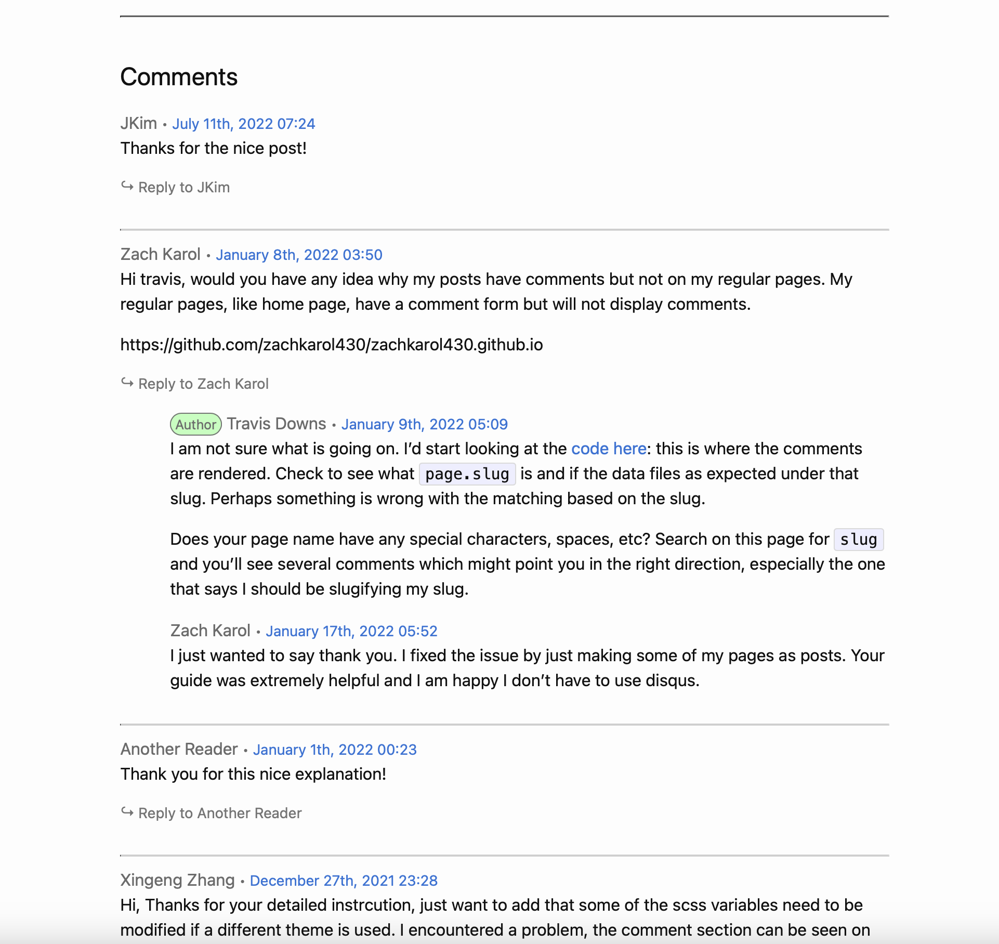

AWKWARD  

Right foot step to the right six inches.  
Turn your toes in slightly, feet parallel.  
Keep your feet like that.  
Inhale, lift your arms up parallel to the floor.  
Five fingers together. Straight elbows.  
Straight spine. Reach forward.  
Contract your triceps muscles.  
Energize the arms.  
Chest up, shoulders down.  
Pull your abdomen in.  
Exhale and Sit down into the imaginary chair.  
Hips down low, as low as your knees,  
lower than you think.  
Stay down there.  
Hips down, chest up.  
Backward bend the spine.  
Bodyweight in the heels, feet flat on the floor.  
Keep your feet parallel.  
Lean back.  
Contract the triceps, reach forward.  
Open the knees and sit down more.  
Hips down, chest up, lean back, reach forward.  
Inhale breathing and come up.  
Keep your arms there.  
SECOND PART  
Come all the way up on your toes.  
Stay up on the toes, to the maximum like a ballerina.  
Spine straight. 
Focus on one point in the mirror.  
Make up your mind, concentrate.  
Sit down into the imaginery chair.  
Lift your knees up, lift your heels up.  
Press your heels forward.  
Pull your abdomen in. Lengthen your spine.  
Upper body back as though you're touching a wall.  
Chest up, shoulders down.  
Sit down on the imaginery chair, no lower than the chair.  
Higher on your toes.   
Knees up, heels up.  
Press your heels forward again. Straight spine.  
Sit down more,  
higher on your toes,  
Inhale breathing and come up, spine straight position, keep your arms there.  
THIRD PART  
Come up a little bit on your toes.  
Squeeze your knees and inner thighs together.  
Sit down, as slowly as possible, with a straight spine.  
This should not hurt the knees.  
If the knees feel good,  
sit all the way down to the heels.  
Once you're all the way down,  
lift off the heels an inch or so.  
Stretch your spine up.  
Touch the imaginery wall with the back of the head and hips.  
Arms parallel to the floor.  
Contract the triceps muscles.  
Squeeze your legs together, knees down.  
Thighs parallel to the floor. 
Arms parallel to the legs, spine perfectly straight, 90 degree angle, so from the side your body looks like a box.  
Take a deep breath, knees together, spine straight, slowly come up.  
Feet together, arms down side, and relax.  
[SECOND SET]  
  
   
{: .commentary}
>Lorem ipsum dolor sit amet, consectetur adipiscing elit, sed do eiusmod tempor incididunt ut labore et dolore magna aliqua. Ut enim ad minim veniam, quis nostrud exercitation ullamco laboris nisi ut aliquip ex  
>ea commodo consequat. Duis aute irure dolor in reprehenderit in voluptate velit esse cillum dolore eu fugiat nulla pariatur. Excepteur sint occaecat cupidatat non proident, sunt in culpa qui officia deserunt mollit anim id est laborum.
  
---
